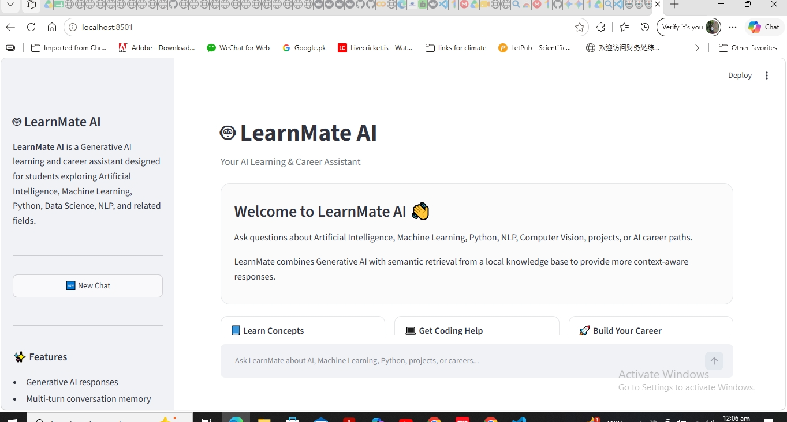
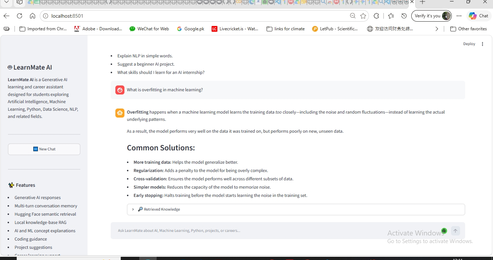
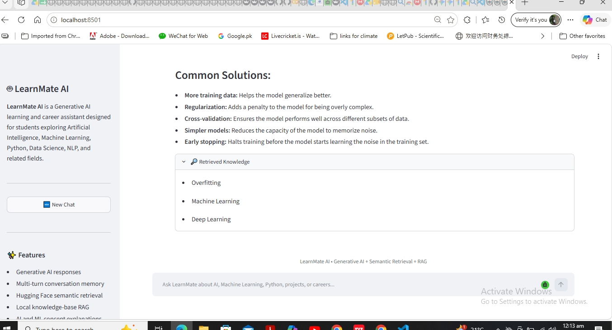
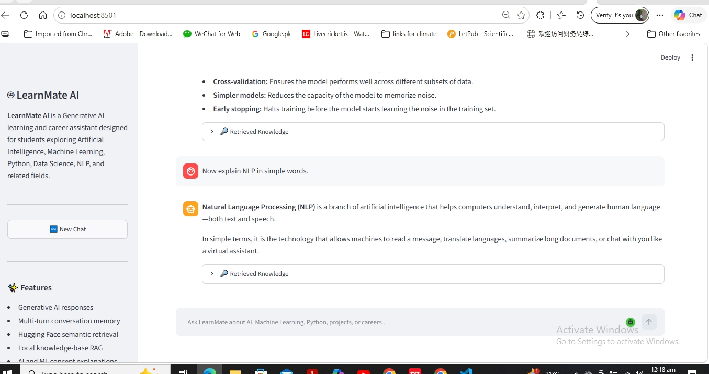
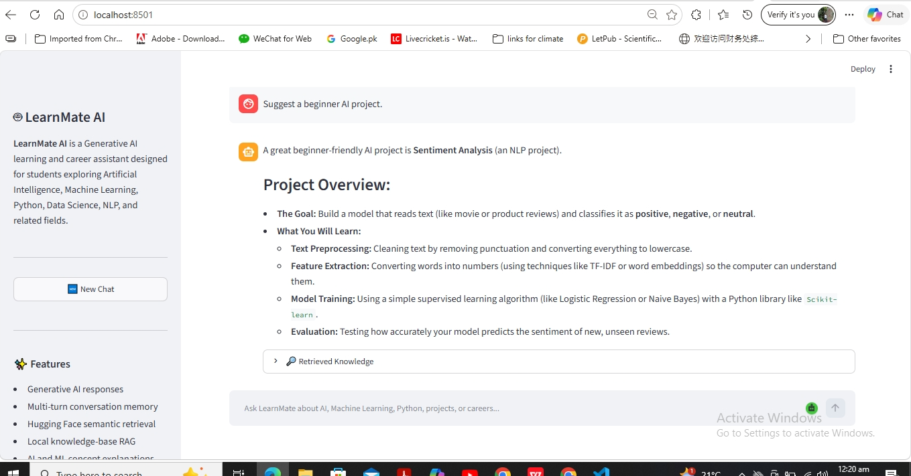
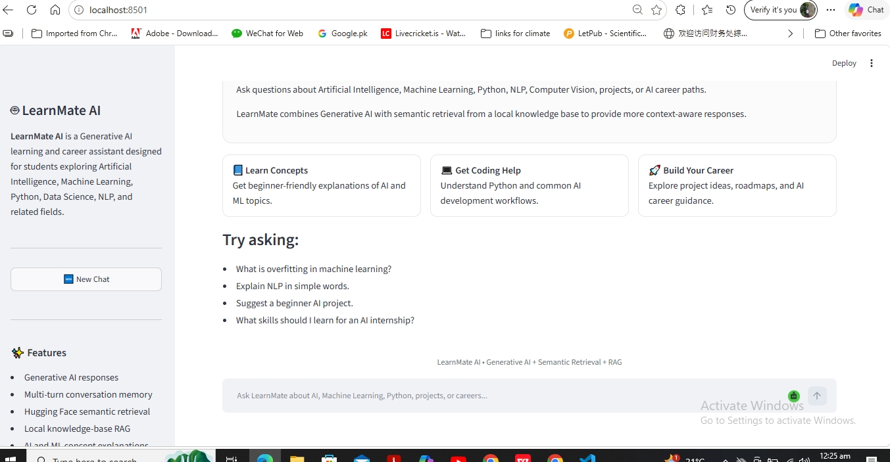
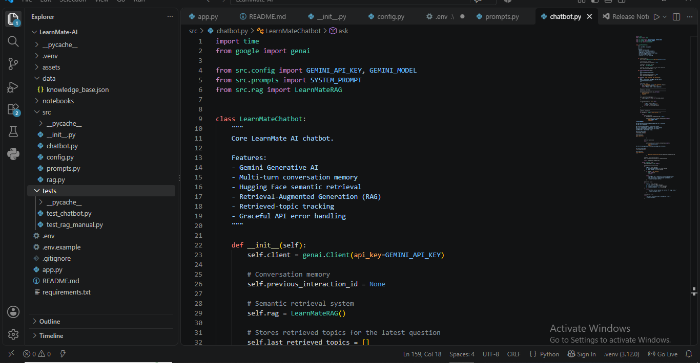

# 🤖 LearnMate AI

### Generative AI Learning & Career Assistant with Semantic Retrieval and RAG

LearnMate AI is an intelligent educational chatbot designed to support students learning Artificial Intelligence, Machine Learning, Deep Learning, Natural Language Processing, Computer Vision, Python, Data Science, and related technologies.

The application combines the Google Gemini API with Hugging Face Sentence Transformers, semantic retrieval, a local knowledge base, and Retrieval-Augmented Generation (RAG) to provide context-aware explanations, coding guidance, project suggestions, and AI career support.

---

## 📌 Project Overview

Students learning Artificial Intelligence often need help with:

- understanding technical concepts,
- learning Python and Machine Learning,
- finding suitable beginner projects,
- planning AI learning roadmaps,
- preparing for internships and AI careers.

Traditional search engines can provide too much scattered information, while simple rule-based chatbots are limited to predefined answers.

**LearnMate AI** addresses this problem by combining Generative AI with semantic retrieval and Retrieval-Augmented Generation.

---

## ✨ Key Features

- 🤖 Generative AI-powered responses
- 🧠 Multi-turn conversation memory
- 🔎 Semantic retrieval using Hugging Face Sentence Transformers
- 📚 Local JSON knowledge base
- 🔗 Retrieval-Augmented Generation (RAG)
- 📘 Beginner-friendly AI and Machine Learning explanations
- 💻 Python and coding guidance
- 🚀 AI project recommendations
- 🎯 AI learning and career guidance
- 🔄 Fresh knowledge retrieval for every user message
- 🆕 New Chat / conversation reset
- 🔍 Visible retrieved knowledge topics
- ⚠️ API rate-limit handling
- 🛡️ Temporary service-error handling
- 🌐 Interactive Streamlit web interface

---

## 🧰 Tech Stack

The project uses:

- **Python**
- **Google Gemini API**
- **Hugging Face Sentence Transformers**
- **Scikit-learn**
- **Streamlit**
- **NumPy**
- **Pandas**
- **JSON**
- **python-dotenv**

---

## 🏗️ System Architecture

```text
User Question
      ↓
Streamlit Web Interface
      ↓
Hugging Face Sentence Transformer
      ↓
Semantic Similarity Search
      ↓
Local Knowledge Base
      ↓
Top Relevant Knowledge Entries
      ↓
Gemini + Retrieved Context
      ↓
LearnMate AI Response
```

Semantic retrieval is performed for every new user message, allowing LearnMate AI to adapt when the topic changes during the same conversation.

---

## 📂 Project Structure

```text
LearnMate-AI/
│
├── app.py
├── README.md
├── requirements.txt
├── .env
├── .env.example
├── .gitignore
│
├── assets/
│
├── data/
│   └── knowledge_base.json
│
├── notebooks/
│
├── src/
│   ├── __init__.py
│   ├── chatbot.py
│   ├── config.py
│   ├── prompts.py
│   └── rag.py
│
└── tests/
    ├── __init__.py
    ├── test_chatbot.py
    └── test_rag_manual.py
```

> **Important:** The `.env` file contains the private API key and must never be uploaded to GitHub.

---

## 🧠 How LearnMate AI Works

LearnMate AI combines semantic retrieval with Generative AI.

### 1. User Question

The user enters a question through the Streamlit interface.

Example:

```text
My model performs very well on training data but poorly on new data.
What is happening?
```

### 2. Semantic Embedding

The question is converted into a numerical embedding using a Hugging Face Sentence Transformer model.

### 3. Knowledge Retrieval

The question embedding is compared with embeddings generated from entries in the local knowledge base.

The most semantically relevant entries are retrieved.

### 4. RAG Context

The retrieved knowledge is inserted into the prompt sent to Gemini.

### 5. Generated Response

Gemini generates the final educational response using:

- the user's question,
- retrieved knowledge,
- system instructions,
- conversation context.

---

## 🔎 Semantic Retrieval Example

A retrieval test was performed using the query:

```text
My model performs very well on training data but poorly on new data.
```

The retrieved topics were:

```text
1. Overfitting
2. Supervised Learning
3. Machine Learning
```

The user did not explicitly use the word **overfitting**, but the semantic retriever correctly identified it as the most relevant topic.

This demonstrates meaning-based retrieval rather than simple keyword matching.

---

## 🔗 Retrieval-Augmented Generation

LearnMate AI uses a lightweight RAG pipeline.

For every user message:

```text
Question
   ↓
Semantic Retrieval
   ↓
Relevant Local Knowledge
   ↓
Gemini Generation
   ↓
Final Response
```

The Streamlit interface also contains a **Retrieved Knowledge** section where users can view the topics retrieved for the current response.

---

## 💬 Multi-Turn Conversation Memory

LearnMate AI supports follow-up conversations.

For example:

```text
User:
What is overfitting in machine learning?

LearnMate AI:
Explains overfitting...

User:
Now explain NLP in simple words.

LearnMate AI:
Switches correctly to Natural Language Processing.
```

The chatbot preserves conversation context while performing fresh semantic retrieval for each new question.

---

## 📚 Supported Learning Areas

LearnMate AI is designed to assist with topics including:

- Artificial Intelligence
- Machine Learning
- Deep Learning
- Natural Language Processing
- Computer Vision
- Python
- Data Science
- AI projects
- AI internships
- AI career guidance
- beginner learning roadmaps

---

## 💻 Streamlit Interface

The application provides a professional web interface built using Streamlit.

The interface includes:

- chatbot conversation view,
- chat input field,
- multi-turn message history,
- New Chat button,
- project description,
- features section,
- technology stack,
- knowledge areas,
- visible retrieved knowledge,
- beginner-friendly example questions.

---

## 🛡️ Error Handling

LearnMate AI includes handling for common API problems.

### API Rate Limit

If the API usage limit is reached, the application returns a clear message asking the user to try again later.

### Temporary Service Overload

If the Gemini service is temporarily unavailable or experiencing high demand, LearnMate retries the request before returning a user-friendly message.

### Invalid Input

Empty questions are detected before sending unnecessary API requests.

### Unexpected Errors

Unexpected API failures are caught and handled without crashing the application.

---

## ⚙️ Installation

### 1. Clone the Repository

```bash
git clone YOUR_REPOSITORY_URL
cd LearnMate-AI
```

### 2. Create a Virtual Environment

```bash
python -m venv .venv
```

### 3. Activate the Virtual Environment

For Windows PowerShell:

```powershell
Set-ExecutionPolicy -Scope Process -ExecutionPolicy Bypass
.\.venv\Scripts\Activate.ps1
```

For Windows Command Prompt:

```cmd
.venv\Scripts\activate
```

### 4. Install Dependencies

```bash
pip install -r requirements.txt
```

---

## 🔐 API Key Setup

Create a file named:

```text
.env
```

in the project root.

Add:

```text
GEMINI_API_KEY=your_api_key_here
```

Do not add quotation marks around the key unless required.

### Security

Never upload your real `.env` file or API key to GitHub.

The repository should contain only:

```text
.env.example
```

with a placeholder such as:

```text
GEMINI_API_KEY=your_api_key_here
```

---

## ▶️ Run the Application

Activate the virtual environment and run:

```bash
streamlit run app.py
```

The application will normally open at:

```text
http://localhost:8501
```

---

## 🧪 Testing

LearnMate AI was tested for several important scenarios.

### Concept Explanation

Example:

```text
What is overfitting in machine learning?
```

### Topic Switching

Example:

```text
What is overfitting?

Now explain NLP in simple words.
```

### Project Guidance

Example:

```text
Suggest a beginner AI project.
```

### Career Guidance

Example:

```text
What skills should I learn for an AI internship?
```

### Fresh Conversation

The **New Chat** button clears the visible conversation and resets the backend conversation memory.

### Semantic Retrieval

The retriever was tested independently to verify that semantically related knowledge is ranked correctly.

---

## 🧪 Manual RAG Test

The project includes:

```text
tests/test_rag_manual.py
```

This script verifies semantic retrieval from the local knowledge base.

It can be run using:

```bash
python -m tests.test_rag_manual
```

Example output:

```text
Query:
My model performs very well on training data but poorly on new data.

Top Retrieved Results:

1. Overfitting
2. Supervised Learning
3. Machine Learning
```

---

## 💡 Example Questions

Users can ask questions such as:

```text
What is overfitting in machine learning?
```

```text
Explain NLP in simple words.
```

```text
Explain neural networks simply.
```

```text
What does train_test_split do in Scikit-learn?
```

```text
Suggest a beginner AI project.
```

```text
What skills should I learn for an AI internship?
```

```text
What should I learn to become an AI engineer?
```

```text
Explain Data Science in simple words.
```

---


## 📸 Application Screenshots

### 🏠 LearnMate AI Home Screen



---

### 🧠 Overfitting Explanation



---

### 🔎 Retrieved Knowledge — RAG



---

### 💬 Multi-Turn NLP Follow-Up



---

### 🚀 AI Project Guidance



---

### 🆕 New Chat / Conversation Reset



---

### 💻 Project Structure in VS Code



## ✅ Project Evaluation

The application was evaluated using questions from multiple categories:

| Category | Example |
|---|---|
| Concept Explanation | Explain supervised learning in simple words |
| Coding Support | What does random_state=42 do? |
| Project Guidance | Suggest a beginner NLP project |
| Career Guidance | What skills should I learn for an AI internship? |
| Scope Handling | Questions outside the intended educational scope |

The evaluation focused on:

- relevance,
- clarity,
- correctness,
- scope alignment,
- response time.

---

## ⚠️ Limitations

Current limitations include:

- the knowledge base contains a limited number of educational topics,
- responses depend on Gemini API availability,
- API free-tier usage limits may temporarily restrict requests,
- semantic retrieval quality depends on the content available in the local knowledge base,
- generated answers may occasionally require human verification,
- the current version is designed primarily for AI learning and career support.

---

## 🔮 Future Improvements

Possible future improvements include:

- larger knowledge bases,
- PDF and document retrieval,
- FAISS or another vector database,
- persistent conversation storage,
- user accounts,
- personalized learning paths,
- quiz generation,
- learning-progress tracking,
- citation-aware RAG,
- cloud deployment,
- support for additional LLM providers,
- document upload functionality.

---

## 🎯 Project Learning Outcomes

This project demonstrates practical experience with:

- Generative AI APIs,
- Large Language Models,
- prompt engineering,
- semantic embeddings,
- sentence transformers,
- cosine similarity,
- Retrieval-Augmented Generation,
- local knowledge bases,
- multi-turn conversational systems,
- API error handling,
- Streamlit application development,
- Python project organization,
- virtual environments,
- testing,
- GitHub-ready project documentation.

---

## 🚀 Project Status

**LearnMate AI core application is complete and functional.**

Completed components include:

- Gemini API integration
- system prompting
- conversation memory
- API error handling
- semantic retrieval
- Hugging Face embeddings
- local knowledge base
- RAG integration
- RAG retrieval on every conversation turn
- visible retrieved knowledge
- Streamlit frontend
- New Chat functionality
- manual testing
- evaluation workflow

---

## 📄 License

This project was developed for educational, internship, and portfolio purposes.

---

## 🙏 Acknowledgements

LearnMate AI was built using technologies and tools from:

- Google Gemini
- Hugging Face
- Sentence Transformers
- Streamlit
- Scikit-learn
- Python open-source ecosystem

---

## 🤖 LearnMate AI

### Learn. Build. Grow with AI. 🚀
